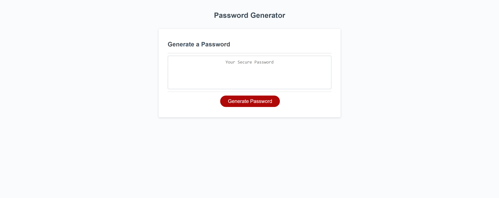
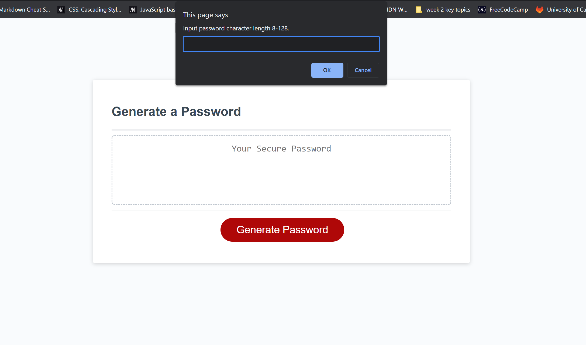
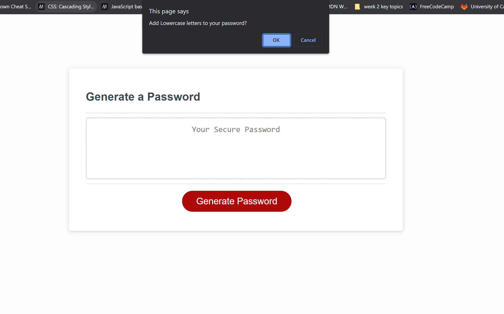
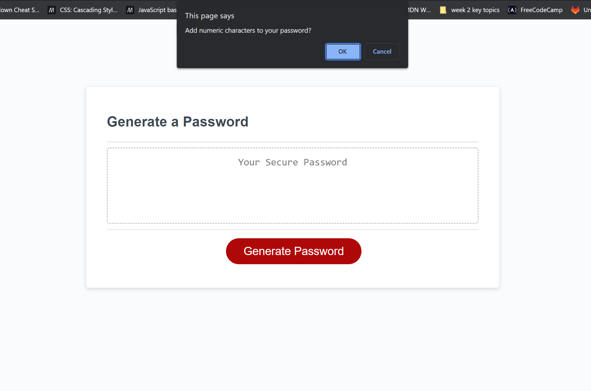
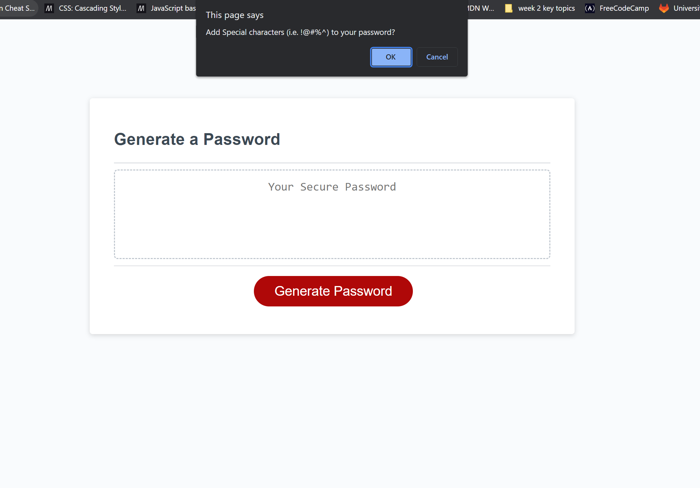
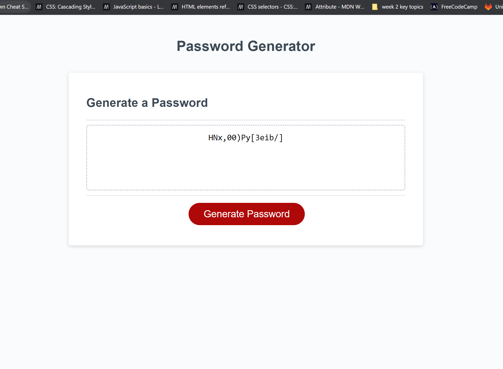

# Quick Passcodes

## Description
---
Quick Passcodes is a configurable password generator. The generator provides a randomized password based on the selected criteria that is given when it is ran. The password generator allows the user to select a length of characters used in the password and what type of characters to be used such as upper and lowercase letters, numberic characters, and special charaters.

## Installation
---
N/A

## Usage
---
The password generator allows the user to create a random password for any application that requires a secure password.

First, the user will be brought to this page

Once you click "Generate Password" a pop-up will appear prompting for the length of the password

When the length is given, then another pop-up will appear confirming to add uppercase letters

Pop-up confirming to add lowercase letters.

 Pop-up confirming to add numeric values.

Pop-up confirming to add special characters.

After all confirms and prompts are answered we get a randomly generated password based off of the configurations that were input by the user

# References

- https://webdesign.tutsplus.com/tutorials/build-a-configurable-random-password-generator-with-javascript--cms-93262

- https://webtips.dev/javascript-password-generator
